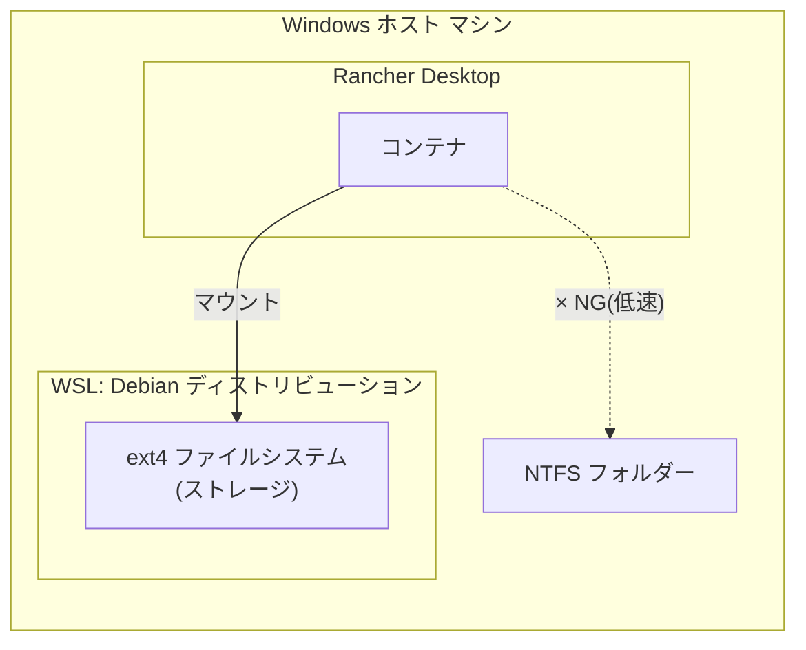

# development-environment

WSL と コンテナランタイム(Rancher Desktop) を組み合わせた開発環境を構築するスクリプト群。

**セットアップ手順に記載されたコマンドを、上から順番にコピー&ペーストして実行するだけで環境構築が完了します。**

## 構成



- **WSL Debian**: ストレージ用途として構築する。ディストリビューション内部のファイルシステムは ext4。
- **Rancher Desktop**: コンテナ(Kubernetes/Docker 互換)を起動するランタイム。
- **マウント方式**: Rancher Desktop で起動したコンテナから、WSL Debian 内のディレクトリをボリュームとしてマウントする。

## 背景・目的

コンテナのボリュームマウント先として Windows 上の NTFS パスを直接指定すると、
WSL2 と Windows ファイルシステム間のブリッジ(9P プロトコル)を経由するため I/O が低速になる。

これを回避するため、ボリュームの実体は WSL Debian 側の ext4 ファイルシステム上に置き、
コンテナからは WSL 内のパスをマウントすることで、ext4 同士(Linux カーネル間)の高速な I/O を実現する。

---

## セットアップ手順

以下のコマンドを、このリポジトリ直下(`development-environment\main`)で **上から順番に** 実行してください。

### 手順1: WSL Debianのインストール

PowerShell を開き、次のコマンドをそのまま貼り付けて実行してください。

```powershell
powershell.exe -ExecutionPolicy Bypass -File .\scripts\Install-DebianWSL.ps1 -Force
```

実行すると、初回のみ画面に `Enter new UNIX username` のような表示が出ます。
任意のユーザー名を入力して Enter を押し、続けてパスワードを入力してください。
(パスワード入力中は画面に文字が表示されませんが、そのまま入力を続けて Enter を押してください)

> このマシンで初めて WSL をインストールする場合、この後 **再起動が必要になることがあります**。
> 再起動を促すメッセージが表示された場合は、Windows を再起動してから手順2に進んでください。
