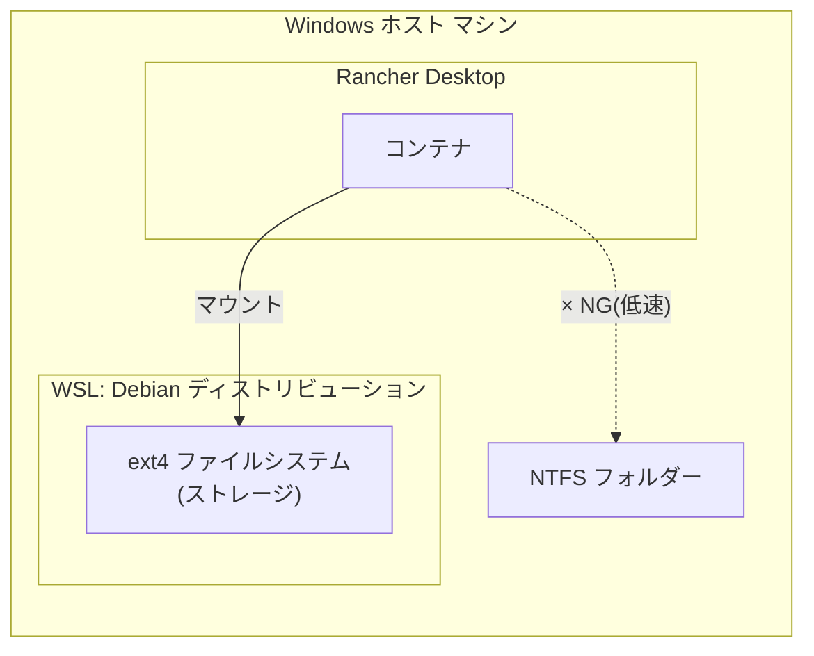

# development-environment

WSL と コンテナランタイム(Rancher Desktop) を組み合わせた開発環境を構築するスクリプト群。

**セットアップ手順に記載されたコマンドを、上から順番にコピー&ペーストして実行するだけで環境構築が完了します。**

## 構成



- **WSL Debian**: ストレージ用途として構築する。ディストリビューション内部のファイルシステムは ext4。
- **Rancher Desktop**: コンテナ(Kubernetes/Docker 互換)を起動するランタイム。
- **マウント方式**: Rancher Desktop で起動したコンテナから、WSL Debian 内のディレクトリをボリュームとしてマウントする。

## 背景・目的

コンテナのボリュームマウント先として Windows 上の NTFS パスを直接指定すると、
WSL2 と Windows ファイルシステム間のブリッジ(9P プロトコル)を経由するため I/O が低速になる。

これを回避するため、ボリュームの実体は WSL Debian 側の ext4 ファイルシステム上に置き、
コンテナからは WSL 内のパスをマウントすることで、ext4 同士(Linux カーネル間)の高速な I/O を実現する。

---

## セットアップ手順

以下のコマンドを、このリポジトリ直下(`development-environment\main`)で **上から順番に** 実行してください。

### 手順1: WSL Debianのインストール

PowerShell を開き、次のコマンドをそのまま貼り付けて実行してください。

```powershell
powershell.exe -ExecutionPolicy Bypass -File .\scripts\Install-DebianWSL.ps1 -Force
```

実行すると、初回のみ画面に `Enter new UNIX username` のような表示が出ます。
任意のユーザー名を入力して Enter を押し、続けてパスワードを入力してください。
(パスワード入力中は画面に文字が表示されませんが、そのまま入力を続けて Enter を押してください)

> このマシンで初めて WSL をインストールする場合、この後 **再起動が必要になることがあります**。
> 再起動を促すメッセージが表示された場合は、Windows を再起動してから手順2に進んでください。

---

## 開発用コンテナイメージ (`create-dockerfile/docker/`)

`create-dockerfile/docker/Dockerfile` は、WSL Debian 上のディレクトリをボリュームマウントして
使う開発用コンテナイメージの定義。ツール構成は
`wsl2-debian-dev-setup` リポジトリの `install-dev-tools.sh` を参考にしている
(git, Node.js/nvm, pnpm, Vue CLI, Claude Code CLI, herdr, jcode, code-server, ripgrep, jq,
gh, Python3+uv, Go, Java, Rust, fzf/fd-find, 日本語ロケール等)。

### 重要: `docker` / `docker compose` は WSL Debian の中から実行する

Rancher Desktop の `docker` クライアントは、`\\wsl$\Debian\...` のような UNC パスを
bind mount のソースとして解釈できない(Rancher Desktop 側の既知の未対応事項)。
そのため、**Windows の PowerShell から** `-v \\wsl$\...` を指定して起動する方式は
`docker: ... includes invalid characters for a local volume name ...` エラーになり、動作しない。

正しい方式は、WSL Debian のシェルに入り、Debian から見えるネイティブパス
(例 `/home/<user>/projects`)を指定して `docker` / `docker compose` を実行することである。
これにより bind mount は ext4(Debian)↔ext4(Rancher Desktop 側 dockerd)間の高速な経路になる。

```powershell
wsl.exe -d Debian
```

### 事前準備(WSL Debian 側、初回のみ)

1. **Rancher Desktop の WSL Integration を有効化する**(GUI操作)。
   Rancher Desktop の `Preferences > WSL > Integrations` で `Debian` をオンにする。
   これにより WSL Debian 内で `docker` コマンドが使えるようになる
   (実体は Windows 側 Rancher Desktop の `dockerd` に接続するクライアント)。

2. **Windows PATH interop により docker credential helper が壊れるため対処する。**
   WSL は既定で Windows 側の `PATH` を Linux 側にも継承する(`appendWindowsPath`)。
   このため `docker`/`buildx` が `docker-credential-wincred.exe`(Windows 用バイナリ)を
   誤って実行しようとして `exec format error` になったり、Rancher Desktop が WSL 内に配置する
   Linux 版 `docker-credential-secretservice` が `libsecret-1.so.0` 不足や D-Bus 未接続で
   失敗したりする。パブリックイメージの pull に認証情報は不要なので、
   `credsStore` を明示的に無効化しておくと安定する。

   ```bash
   mkdir -p ~/.docker
   # 既存の cliPluginsExtraDirs 等は残しつつ credsStore だけ "none" にする
   echo '{"credsStore":"none"}' > ~/.docker/config.json
   ```

   これでも `docker-credential-secretservice: error while loading shared libraries:
   libsecret-1.so.0` が出る場合は、依存ライブラリを入れる(害はないので入れておいてよい):

   ```bash
   sudo apt-get update && sudo apt-get install -y libsecret-1-0
   ```

### ビルド

WSL Debian のシェル内で実行する。

```bash
cd /mnt/d/GitWorkspace/github/development-environment/create-dockerfile/docker
# もしくは Debian 側にリポジトリを clone 済みならそのパスで
docker build -t dev-container .
```

WSL Debian 側の実行ユーザーと UID/GID を揃えたい場合(`id -u` / `id -g` で確認):

```bash
docker build --build-arg USER_UID=1000 --build-arg USER_GID=1000 -t dev-container .
```

### 実行(常時起動): docker compose

`compose.yaml` は `restart: always` を設定しており、Rancher Desktop が起動している限り
コンテナが自動起動・自動復帰し続ける(異常終了時も再起動される)。

1. `.env.example` をコピーして `.env` を作成し、`WSL_MOUNT_SOURCE` に **WSL Debian 側の
   ネイティブパス**(例 `/home/<user>/projects`)を設定する(UID/GID も必要に応じて調整)。

   ```bash
   cd /mnt/d/GitWorkspace/github/development-environment/create-dockerfile/docker
   cp .env.example .env
   vi .env
   ```

2. 起動する(WSL Debian のシェル内で)。

   ```bash
   docker compose up -d --build
   ```

   Windows 側から起動したい場合は、`start-dev-container.bat` をダブルクリック(または
   PowerShell/コマンドプロンプトから実行)すればよい。内部で `wsl.exe -d Debian` 経由で
   上記と同じ `docker compose up -d --build` を実行する。

3. 停止・再開:

   ```bash
   docker compose stop    # 一時停止(自動復帰しない)
   docker compose start   # 再開
   docker compose down    # コンテナ削除(イメージは残る)
   ```

   Windows 側からは `stop-dev-container.bat` で一時停止できる(`docker compose stop` 相当)。
   再開は `start-dev-container.bat`(`up -d --build` は既存コンテナがあれば作り直さず起動するだけ)。
   コンテナを完全に削除したい場合は WSL Debian のシェルで `docker compose down` を実行すること
   (bat は用意していない)。

常駐サービスは `entrypoint.sh` が環境変数フラグでオプトイン起動する
(`compose.yaml` ではすべて `true` に設定済み):

| 環境変数 | 起動するもの |
| --- | --- |
| `START_CODE_SERVER=true` | code-server (ポート 8153, 認証なし) |
| `START_JCODE=true` | `jcode serve` |
| `START_HERDR=true` | `herdr server` |

### コンテナへの接続(docker exec)

SSH は使わず、`docker exec` でコンテナ内に直接シェルを開いて接続する
(SSH は鍵配布・パスワード管理・接続不良のトラブルが多く、ホスト側から
コンテナへ直接入れる `docker exec` の方が確実でシンプルなため採用した)。

WSL Debian のシェルから接続する場合:

```bash
docker exec -it dev-container bash
```

Windows 側から接続したい場合は `exec-dev-container.bat` を使う。事前に
コンテナが起動しているかをチェックし、起動していなければエラーメッセージを
表示して終了する。内部では `wsl.exe -d Debian -- docker exec -it dev-container bash`
を実行する。

### 実行(手動・使い捨て): docker run

常駐させず一時的に起動したい場合の例(WSL Debian のシェル内、ネイティブパスを指定):

```bash
docker run -it --rm \
  -v /home/<user>/projects:/workspace \
  -p 8153:8153 \
  -e START_CODE_SERVER=true -e START_JCODE=true -e START_HERDR=true \
  dev-container bash
```

### 参考スクリプトから除外した項目

- **Windows PATH interop 無効化 / systemd 有効化(`/etc/wsl.conf`)**: WSL ディストリビューション固有の設定であり、コンテナには存在しない。コンテナ内のサービス起動は `entrypoint.sh` が直接管理する。ただし WSL Debian 側で `docker` コマンドを実行するホスト用途では、上記の「事前準備」で述べた PATH interop に起因する credential helper の問題に注意すること。
- **Docker Engine**: コンテナランタイムはホスト側の Rancher Desktop が担うため、コンテナ内に Docker-in-Docker は構築しない。
