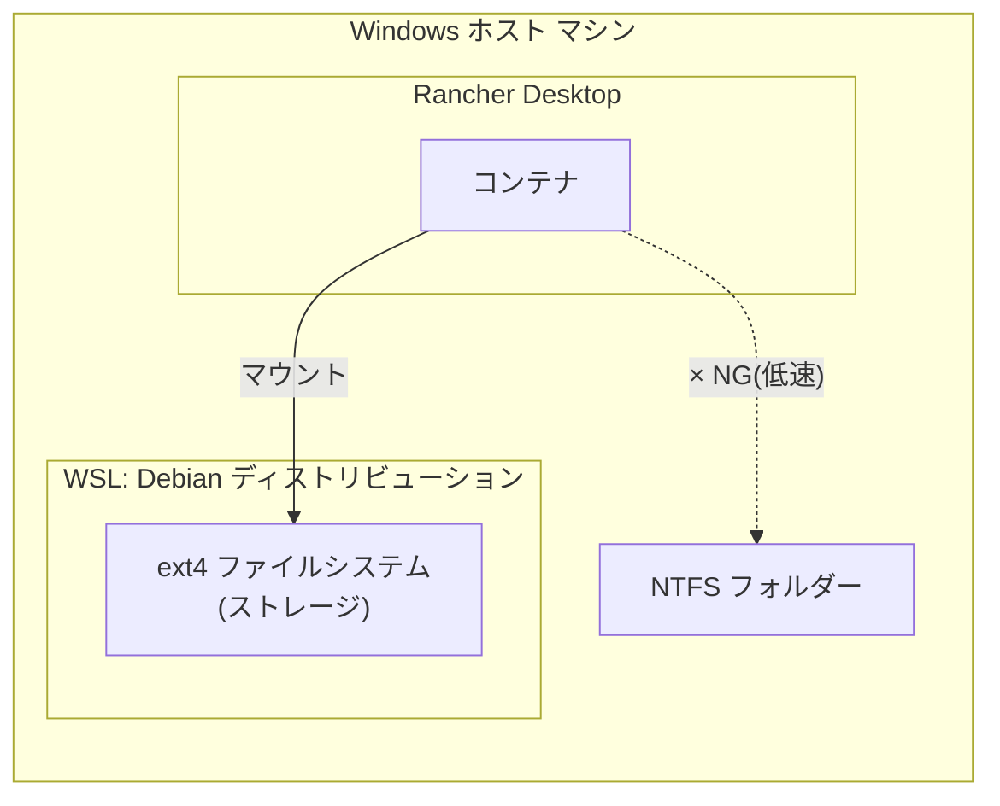

# 背景・設計判断

## なぜ WSL Debian + Rancher Desktop の組み合わせなのか

コンテナのボリュームマウント先として Windows 上の NTFS パスを直接指定すると、
WSL2 と Windows ファイルシステム間のブリッジ(9P プロトコル)を経由するため I/O が低速になる。

これを回避するため、ボリュームの実体は WSL Debian 側の ext4 ファイルシステム上に置き、
コンテナからは WSL 内のパスをマウントすることで、ext4 同士(Linux カーネル間)の高速な I/O を実現する。

- **WSL Debian**: ストレージ用途として構築する。ディストリビューション内部のファイルシステムは ext4。
- **Rancher Desktop**: コンテナ(Kubernetes/Docker 互換)を起動するランタイム。
- **マウント方式**: Rancher Desktop で起動したコンテナから、WSL Debian 内のディレクトリをボリュームとしてマウントする。

## なぜ `docker` / `docker compose` は WSL Debian の中から実行するのか

Rancher Desktop の `docker` クライアントは、`\\wsl$\Debian\...` のような UNC パスを
bind mount のソースとして解釈できない(Rancher Desktop 側の既知の未対応事項)。
そのため、**Windows の PowerShell から** `-v \\wsl$\...` を指定して起動する方式は
`docker: ... includes invalid characters for a local volume name ...` エラーになり、動作しない。

正しい方式は、WSL Debian のシェルに入り、Debian から見えるネイティブパス
(例 `/home/<user>/projects`)を指定して `docker` / `docker compose` を実行することである。
これにより bind mount は ext4(Debian)↔ext4(Rancher Desktop 側 dockerd)間の高速な経路になる。

## Windows PATH interop による docker credential helper の破損

WSL は既定で Windows 側の `PATH` を Linux 側にも継承する(`appendWindowsPath`)。
このため `docker`/`buildx` が `docker-credential-wincred.exe`(Windows 用バイナリ)を
誤って実行しようとして `exec format error` になったり、Rancher Desktop が WSL 内に配置する
Linux 版 `docker-credential-secretservice` が `libsecret-1.so.0` 不足や D-Bus 未接続で
失敗したりする。パブリックイメージの pull に認証情報は不要なので、
`credsStore` を明示的に無効化しておくと安定する(README.md の「事前準備」参照)。

## `docker exec` を使う理由(SSH を使わない理由)

SSH は鍵配布・パスワード管理・接続不良のトラブルが多く、ホスト側からコンテナへ
直接入れる `docker exec` の方が確実でシンプルなため採用した。ログインパスワードも
設定していない。

## ツール構成の参考元と除外した項目

`Dockerfile` のツール構成は `wsl2-debian-dev-setup` リポジトリの
`install-dev-tools.sh` を参考にしている
(git, Node.js/nvm, pnpm, Vue CLI, Claude Code CLI, herdr, jcode, code-server,
ripgrep, jq, gh, Python3+uv, Go, Java, Rust, fzf/fd-find, 日本語ロケール等)。

参考スクリプトから以下は除外した:

- **Windows PATH interop 無効化 / systemd 有効化(`/etc/wsl.conf`)**: WSL
  ディストリビューション固有の設定であり、コンテナには存在しない。コンテナ内の
  サービス起動は `entrypoint.sh` が直接管理する。
- **Docker Engine(docker-ce 一式)**: コンテナランタイムはホスト側の
  Rancher Desktop が担うため、コンテナ内に Docker-in-Docker は構築しない。
  ただし、コンテナ内から `docker` コマンドを使いたいという要望に対応するため、
  docker-ce-cli(クライアントのみ)は追加した。詳細は次節参照。

## コンテナ内から `docker` コマンドを使う(ホストの Docker ソケットを共有)

コンテナ内で Docker Engine 自体を動かす(Docker-in-Docker)のではなく、
ホスト(Rancher Desktop)側の Docker デーモンをそのまま共有する方式にした。

- **Dockerfile**: `docker-ce-cli` と `docker-compose-plugin`(クライアント側の
  実行ファイルのみ)を Docker 公式 apt リポジトリからインストールする。
  `docker-ce`(デーモン本体)や `containerd` はインストールしない。
- **compose.yaml**: ホストの `/var/run/docker.sock` をコンテナの
  `/var/run/docker.sock` へそのままバインドマウントする。Rancher Desktop は
  WSL2 の内部 VM(`rancher-desktop` ディストリビューション)上で dockerd を
  動かし、そのソケットを WSL Debian からも `/var/run/docker.sock` として
  見える形で公開しているため、WSL Debian のシェルから `docker compose up` を
  実行する限り、追加の設定なしにこのパスをそのままマウントできる。
- **entrypoint.sh**: バインドマウントしたソケットの所有 GID はホスト
  (Rancher Desktop 側 VM)の docker グループの GID であり、コンテナ内の
  `developer` ユーザーの GID とは通常一致しない。そのため起動のたびにソケットの
  GID を確認し、コンテナ内に同じ GID のグループを作成して `developer` を
  追加してから残りの起動処理を `exec sg <group> -c ...` で再実行することで、
  `sudo` なしで `docker` コマンドを使えるようにしている。

この方式では、コンテナ内で作成したコンテナ・イメージ等はすべてホスト側の
Docker デーモンの管理下に置かれる(コンテナの中に入れ子でコンテナが動くわけ
ではない)。たとえばコンテナ内で `docker run` したコンテナのボリューム
バインドマウントのソースパスは、コンテナ内から見えるパスではなく、ホスト
(dockerd が動く Rancher Desktop VM)から見えるパスとして解釈される点に注意する。

