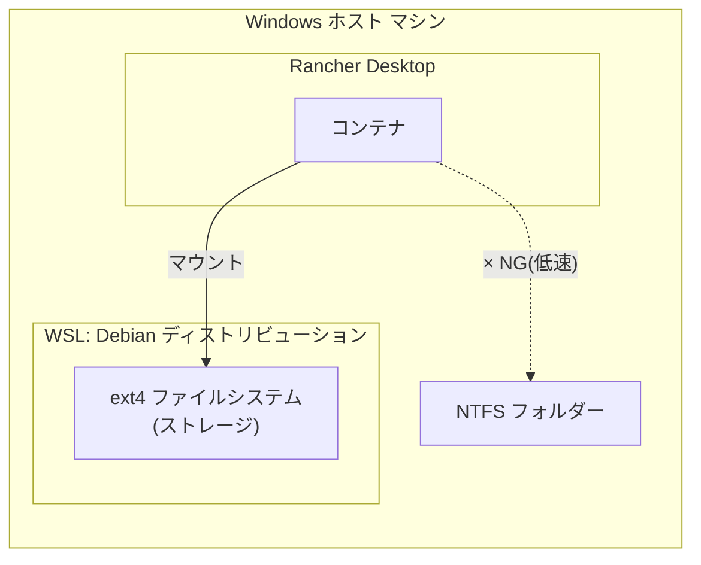

# 背景・設計判断

## なぜ WSL Debian + Rancher Desktop の組み合わせなのか



コンテナのボリュームマウント先として Windows 上の NTFS パスを直接指定すると、
WSL2 と Windows ファイルシステム間のブリッジ(9P プロトコル)を経由するため I/O が低速になる。

これを回避するため、ボリュームの実体は WSL Debian 側の ext4 ファイルシステム上に置き、
コンテナからは WSL 内のパスをマウントすることで、ext4 同士(Linux カーネル間)の高速な I/O を実現する。

- **WSL Debian**: ストレージ用途として構築する。ディストリビューション内部のファイルシステムは ext4。
- **Rancher Desktop**: コンテナ(Kubernetes/Docker 互換)を起動するランタイム。
- **マウント方式**: Rancher Desktop で起動したコンテナから、WSL Debian 内のディレクトリをボリュームとしてマウントする。

## なぜ `docker` / `docker compose` は WSL Debian の中から実行するのか

Rancher Desktop の `docker` クライアントは、`\\wsl$\Debian\...` のような UNC パスを
bind mount のソースとして解釈できない(Rancher Desktop 側の既知の未対応事項)。
そのため、**Windows の PowerShell から** `-v \\wsl$\...` を指定して起動する方式は
`docker: ... includes invalid characters for a local volume name ...` エラーになり、動作しない。

正しい方式は、WSL Debian のシェルに入り、Debian から見えるネイティブパス
(例 `/home/<user>/projects`)を指定して `docker` / `docker compose` を実行することである。
これにより bind mount は ext4(Debian)↔ext4(Rancher Desktop 側 dockerd)間の高速な経路になる。

## Windows PATH interop による docker credential helper の破損

WSL は既定で Windows 側の `PATH` を Linux 側にも継承する(`appendWindowsPath`)。
このため `docker`/`buildx` が `docker-credential-wincred.exe`(Windows 用バイナリ)を
誤って実行しようとして `exec format error` になったり、Rancher Desktop が WSL 内に配置する
Linux 版 `docker-credential-secretservice` が `libsecret-1.so.0` 不足や D-Bus 未接続で
失敗したりする。パブリックイメージの pull に認証情報は不要なので、
`credsStore` を明示的に無効化しておくと安定する(README.md の「事前準備」参照)。

## `docker exec` を使う理由(SSH を使わない理由)

SSH は鍵配布・パスワード管理・接続不良のトラブルが多く、ホスト側からコンテナへ
直接入れる `docker exec` の方が確実でシンプルなため採用した。ログインパスワードも
設定していない。

## ツール構成の参考元と除外した項目

`Dockerfile` のツール構成は `wsl2-debian-dev-setup` リポジトリの
`install-dev-tools.sh` を参考にしている
(git, Node.js/nvm, pnpm, Vue CLI, Claude Code CLI, herdr, jcode, code-server,
ripgrep, jq, gh, Python3+uv, Go, Java, Rust, fzf/fd-find, 日本語ロケール等)。

参考スクリプトから以下は除外した:

- **Windows PATH interop 無効化 / systemd 有効化(`/etc/wsl.conf`)**: WSL
  ディストリビューション固有の設定であり、コンテナには存在しない。コンテナ内の
  サービス起動は `entrypoint.sh` が直接管理する。
- **Docker Engine(docker-ce 一式)**: コンテナランタイムはホスト側の
  Rancher Desktop が担うため、コンテナ内に Docker-in-Docker は構築しない。
  ただし、コンテナ内から `docker` コマンドを使いたいという要望に対応するため、
  docker-ce-cli(クライアントのみ)は追加した。詳細は次節参照。

## コンテナ内から `docker` コマンドを使う(ホストの Docker ソケットを共有)

コンテナ内で Docker Engine 自体を動かす(Docker-in-Docker)のではなく、
ホスト(Rancher Desktop)側の Docker デーモンをそのまま共有する方式にした。

- **Dockerfile**: `docker-ce-cli` と `docker-compose-plugin`(クライアント側の
  実行ファイルのみ)を Docker 公式 apt リポジトリからインストールする。
  `docker-ce`(デーモン本体)や `containerd` はインストールしない。
- **compose.yaml**: ホストの `/var/run/docker.sock` をコンテナの
  `/var/run/docker.sock` へそのままバインドマウントする。Rancher Desktop は
  WSL2 の内部 VM(`rancher-desktop` ディストリビューション)上で dockerd を
  動かし、そのソケットを WSL Debian からも `/var/run/docker.sock` として
  見える形で公開しているため、WSL Debian のシェルから `docker compose up` を
  実行する限り、追加の設定なしにこのパスをそのままマウントできる。
- **entrypoint.sh**: バインドマウントしたソケットの所有 GID はホスト
  (Rancher Desktop 側 VM)の docker グループの GID であり、コンテナ内の
  `developer` ユーザーの GID とは通常一致しない。そのため起動のたびにソケットの
  GID を確認し、コンテナ内に同じ GID のグループを作成して `developer` を
  追加してから残りの起動処理を `exec sg <group> -c ...` で再実行することで、
  `sudo` なしで `docker` コマンドを使えるようにしている。

この方式では、コンテナ内で作成したコンテナ・イメージ等はすべてホスト側の
Docker デーモンの管理下に置かれる(コンテナの中に入れ子でコンテナが動くわけ
ではない)。たとえばコンテナ内で `docker run` したコンテナのボリューム
バインドマウントのソースパスは、コンテナ内から見えるパスではなく、ホスト
(dockerd が動く Rancher Desktop VM)から見えるパスとして解釈される点に注意する。


## ホストの全ドライブ(Windows の C:, D: 等)をコンテナにマウントする

WSL は起動時に、Windows ホスト側の各ドライブを自動的に `/mnt/c`, `/mnt/d` ...
としてマウントしている(`wsl.conf` の `automount` 既定動作。ドライバは環境に
よって DrvFS または virtiofs)。コンテナ側から全ドライブへアクセスしたいが、
`/mnt` を丸ごとバインドマウントすると以下の問題があったため、現在は
ドライブごとに個別のバインドマウントを動的生成する方式にしている。

- **問題(以前の方式)**: `/mnt` はその配下に `/mnt/c`, `/mnt/d` ... という
  個別のマウントポイントがネストされたディレクトリである。このディレクトリを
  そのままバインドマウントすると、コンテナ再作成時に Rancher Desktop 側の
  アンマウント処理がネストされたマウントポイントを含むディレクトリを
  一括アンマウントしようとして失敗し、`start-dev-container.bat` が次の
  エラーで失敗することがあった:
  ```text
  Error response from daemon: failed to modify the response from the
  backend: munger failed for /containers/.../start: could not unmount
  bind mount ...: invalid argument
  ```
- **対処(現在の方式)**: `scripts/generate-host-drives-compose.sh` が
  `start-dev-container.bat`/`stop-dev-container.bat` 実行時に WSL Debian 側で
  自動実行され、`/proc/mounts` から `WSL_HOST_DRIVES_SOURCE`(既定値 `/mnt`)
  配下で実際にマウントされているドライブ(`/mnt/c`, `/mnt/d` 等)を検出し、
  ドライブ1つにつき1行のバインドマウントを定義する
  `docker/config/compose.host-drives.yaml`(自動生成物。`.gitignore` 対象)を
  生成する。`start-dev-container.bat`/`stop-dev-container.bat` は
  `docker compose -f compose.yaml -f compose.host-drives.yaml ...` の形で
  この override ファイルを追加読み込みする。ネストマウントを含まない末端の
  ディレクトリ(ドライブ単位)だけをバインドマウントするため、アンマウント時に
  上記のエラーは発生しない。
- コンテナ内からは `/mnt/host-drives/c/...`、`/mnt/host-drives/d/...` の
  ように各ドライブへアクセスできる。コンテナ内の `/mnt` 直下
  (`/mnt/host-drives` を含む)を直接使わず `/mnt/host-drives` という専用
  パスにしているのは、コンテナ内で別途 `/mnt` 配下を使う他のマウント
  (将来的な追加分も含む)と衝突しないようにするため。
- `/workspace`(WSL Debian 側 ext4 を直接マウント)とは異なり、こちらは
  DrvFS/virtiofs 経由であるため I/O は低速になる。大きなビルド成果物の
  読み書きなど I/O 負荷が高い作業には向かない。Windows 側ファイルをやり取り
  する用途(参照・コピー等)を想定している。
- `setup-dev-container.sh` の `mkdir -p`/`chown` 対象には含めていない。
  `/mnt` は WSL がシステムとして自動管理する既存のマウントポイントであり、
  ホストの全ドライブに対して再帰的な `chown` を行うのは危険かつ不要なため
  (元々 Windows 側の各ユーザー・ACL で権限管理されている)。
- 新しいドライブを WSL にマウントし直した場合(例: USB ドライブ接続後)は、
  `start-dev-container.bat` を再実行すれば `generate-host-drives-compose.sh`
  が再検出して `compose.host-drives.yaml` を更新する。
- **ネットワークドライブ(Z: など)について**: WSL は起動時に Windows の
  ローカル/固定ドライブ(C:, D: 等)しか自動マウントせず、Windows でドライブ
  文字にマップしたネットワークドライブ(`net use Z: \\server\share` や
  エクスプローラーの「ネットワークドライブの割り当て」で設定したもの)は
  自動では WSL 側に現れない。ドライブ文字の割り当ては環境ごとに異なるため
  ハードコーディングできない。そこで `start-dev-container.bat`/
  `stop-dev-container.bat` は `scripts/mount-network-drives.sh` を
  `wsl.exe -u root`(パスワード不要で root 権限を取得できる)経由で実行し、
  以下の手順で動的にマウントする:
  1. `scripts/list-network-drives.ps1` が Windows 側で
     `WScript.Network.EnumNetworkDrives()` を呼び出し、現在マップされている
     ネットワークドライブ(ドライブ文字と UNC パスの組)を列挙する。
  2. まだ `/mnt/<ドライブ文字>` にマウントされていなければ、
     `mount -t drvfs <UNCパス> /mnt/<ドライブ文字> -o metadata,uid=...,gid=...`
     でマウントする(idempotent。既にマウント済みなら何もしない)。
  3. これで `/mnt` 配下にローカルドライブと同様に現れるため、後続の
     `generate-host-drives-compose.sh` が通常のドライブと同じ扱いで検出し、
     `compose.host-drives.yaml` に個別のバインドマウントとして追加する。
  - ネットワークドライブが切断されている(VPN 未接続等)場合はマウントに
    失敗するが、致命的エラーにはせず警告を出して続行する(そのドライブは
    コンテナから見えないだけで、他の処理には影響しない)。

## jcode 用コンテキスト圧縮ツール(rtk / lean-ctx)を入れた理由

jcode エージェントがシェルコマンド(`git log`, `cargo test` 等)を実行すると、
出力全文がそのままコンテキストウィンドウに乗ってしまい、トークンを大量に
消費する。これを緩和するため、出力を要約・圧縮する2つの CLI をイメージに
焼き込んでいる。

- **rtk**(Rust Token Killer): `rtk git status` のように明示的にコマンドへ
  前置して使う圧縮プロキシ。jcode 側に組み込みのフック機構が無いため、
  自動書き換えはできない(利用は `docker/config/preferred-tools.md` 経由の
  提案止まり)。
- **lean-ctx**: シェルの alias 方式フックと MCP サーバー(`ctx_read` 等)の
  両方を提供する。MCP サーバーとしては `docker/Dockerfile` がビルド時に
  `$JCODE_HOME/mcp.json` へ登録し、シェルフックとしては `lean-ctx init
  --global` が生成した `~/.config/lean-ctx/{env.sh,shell-hook.bash}` を
  ベースに使う。

### なぜ非対話シェル向けの追加ラッパー(jcode-env.sh)が必要か

lean-ctx の標準シェルフックは bash の **alias** で実装されており、
alias 展開は対話シェルでは既定で有効だが、非対話シェル(`bash -c "..."`)では
`shopt -s expand_aliases` を明示しない限り無効になる。jcode の `Bash` ツールは
コマンドをまさにこの `bash -c "..."` の形で実行するため、`~/.bashrc` への
追記(対話シェル前提)だけでは効かない。

対処として、Dockerfile が `~/.config/lean-ctx/jcode-env.sh` という薄い
ラッパー(`shopt -s expand_aliases` を立ててから本体の `env.sh` を読み込むだけ)
を生成し、`compose.yaml` の `BASH_ENV`/`LEAN_CTX_AGENT` 環境変数でこれを
使わせている。`BASH_ENV` は非対話シェルでのみ読み込まれる変数のため、
`docker exec -it dev-container bash` で入る対話シェルの挙動には影響しない。

### なぜ `entrypoint.sh` でも mcp.json / preferred-tools.md を補完するか

`$JCODE_HOME`(`~/.jcode-data`)は compose.yaml で永続化用にバインドマウント
しているため、初回起動時はホスト側の空ディレクトリで隠れてしまう
(他の `config.toml` 等と同じ問題。上記「1. apt base packages」節や
`docs/PERSISTENCE.md` 参照)。そのため `entrypoint.sh` が起動のたびに
「無ければ補完する」形で、lean-ctx の MCP サーバー登録とガイダンス文書
(`preferred-tools.md`)を復元する。mcp.json は他の MCP サーバー設定を
壊さないよう `jq` でマージしている。
